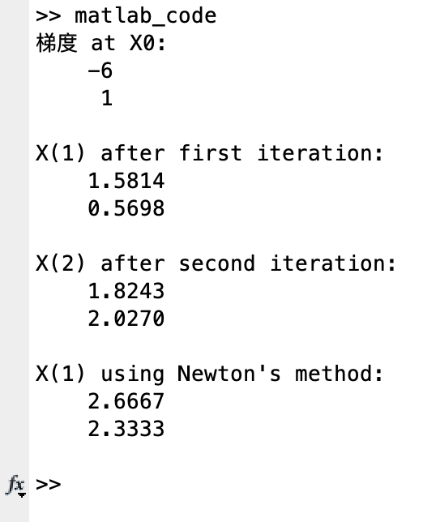
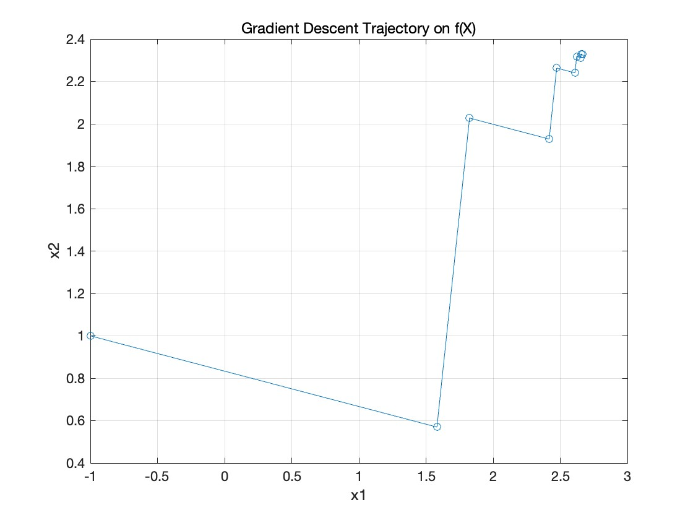

# 智能优化算法作业2

一、实验描述
---
原函数： $ f(x) = x_1^2 + x_2^2 - x_1x_2 - 3x_1 - 2x_2 $
1. 对指定函数，转化成标准二次形式，求解参数矩阵A, b，以及梯度∇f(X)
2. 利用精确搜索梯度法进行两次迭代求解，分别计算迭代后的解X(1)和X(2)，并写出计算过程
3. 利用牛顿法进行一次迭代求解，计算迭代后的解Xn(1)，并写出计算过程
4. 利用精确搜索梯度法例程，编程实现迭代求解最小值，绘制迭代轨迹，并给出源代码。其中，停止误差为ξ = 0.01
5. 根据以上结果，试分析梯度法与牛顿法的异同

二、MATLAB代码实现
---
```
`%% (1)计算AB矩阵和梯度
% 原函数转化成标准二次形式时，手算可得到AB矩阵
% 定义A和b
A = [2, -1; -1, 2];
b = [-3; -2];

% 初始值
X0 = [-1; 1];

% 计算梯度
grad_f = A * X0 + b;

% 显示结果
disp('梯度 at X0:');
disp(grad_f);


%% (2)精确搜索
% 第一次迭代
grad_f0 = A * X0 + b;
alpha0 = -(grad_f0' * grad_f0) / (grad_f0' * A * grad_f0); % 计算步长
X1 = X0 + alpha0 * grad_f0;                                % 更新位置

% 第二次迭代
grad_f1 = A * X1 + b;
alpha1 = -(grad_f1' * grad_f1) / (grad_f1' * A * grad_f1);
X2 = X1 + alpha1 * grad_f1;

% 显示结果
disp('X(1) after first iteration:');
disp(X1);
disp('X(2) after second iteration:');
disp(X2);

%% (3)牛顿法一次迭代
H = A;                          % 对于二次函数，Hessian矩阵就是A
grad_f0 = A * X0 + b;
delta_X = -inv(H) * grad_f0;    % 牛顿步
X1_newton = X0 + delta_X;

% 显示结果
disp('X(1) using Newton''s method:');
disp(X1_newton);


%% (4)精确搜索梯度法的迭代
% 定义A, b, 和初始值
A = [2, -1; -1, 2];
b = [-3; -2];
X = [-1; 1];

% 初始化参数
epsilon = 0.01;             % 停止误差
max_iters = 1000;           % 最大迭代次数
iter = 1;

% 存储迭代结果用于绘图
X_hist = X;                 % 存储历史数据

% 迭代求解
while true
    grad_f = grad(X);
    if norm(grad_f, 2) < epsilon || iter > max_iters
        break;
    end
    alpha = -(grad_f' * grad_f) / (grad_f' * A * grad_f);
    X = X + alpha * grad_f;
    X_hist = [X_hist X];    % 追加新的数据点
    iter = iter + 1;
end

% 绘制迭代轨迹
plot(X_hist(1,:), X_hist(2,:), 'o-');
title('Gradient Descent Trajectory on f(X)');
xlabel('x1');
ylabel('x2');
grid on;

%% 函数定义

% 原函数
function y = func(X)
    y = X(1)^2 + X(2)^2 - X(1)*X(2) - 3*X(1) - 2*X(2);
end

% 原函数的梯度
function g = grad(X)
    g = [2*X(1) - X(2) - 3; 2*X(2) - X(1) - 2];
end
```

二、实验结果
---
## 1. 实验1-3代码运行结果

## 2. 实验4代码运行结果

## 3. 实验5分析
### 相同点
* 都是迭代方法，通过从初始估计出发，逐步更新解，直至达到收敛条件
* 目的都是寻找函数的局部最小值
### 不同点
* 更新规则不一样
* 梯度法收敛速度较慢，牛顿法收敛速度较快
* 梯度法计算复杂度远小于牛顿法